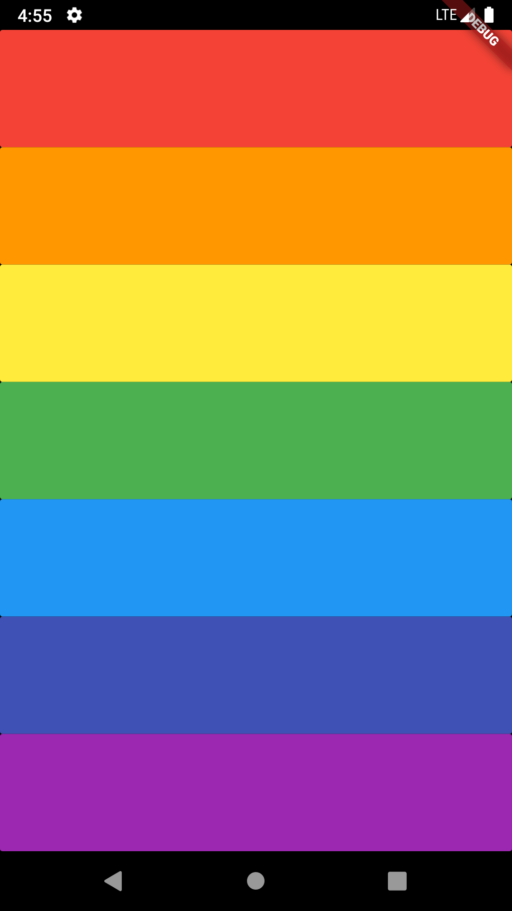

# Xylophone 🎹

## Flutter app to produce diffrernt audio notes when clicked on seven patterns(buttons)

> Built as part of **The Complete Flutter Development Bootcamp with Dart** course by Angela Yu